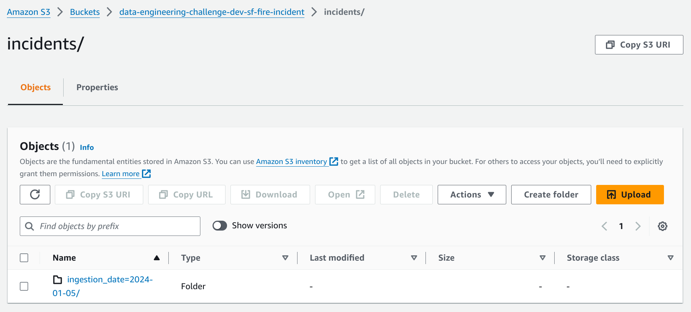
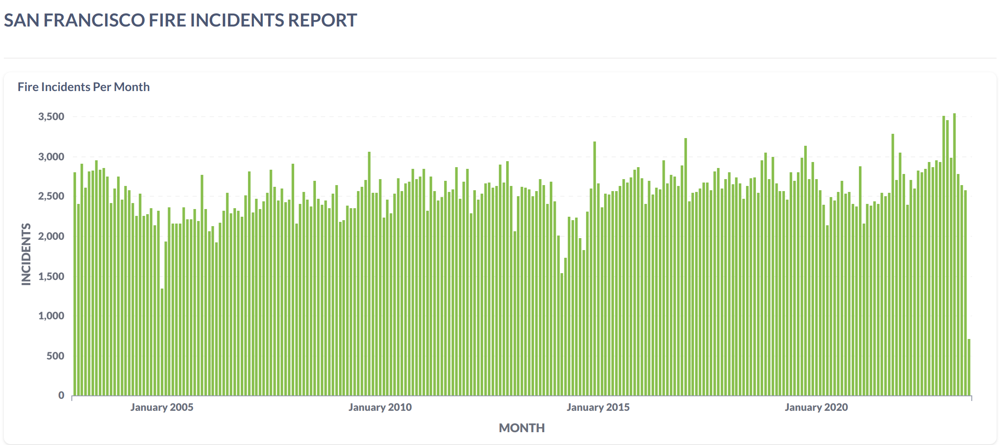
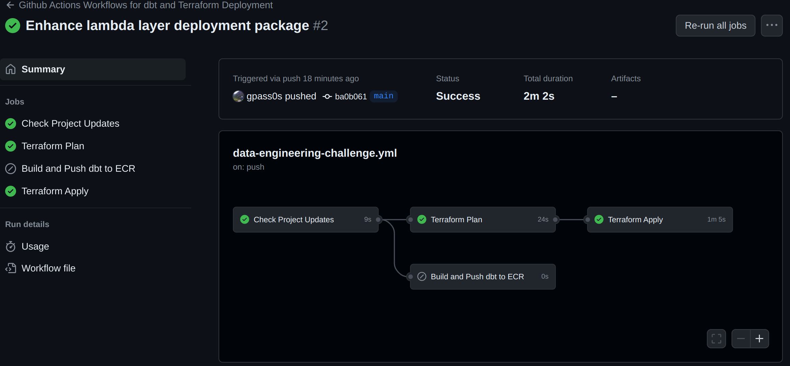
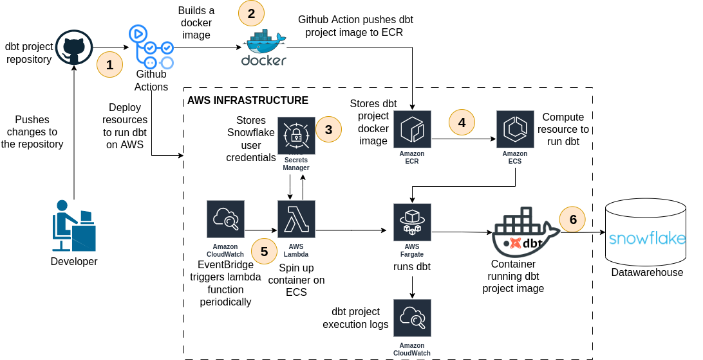
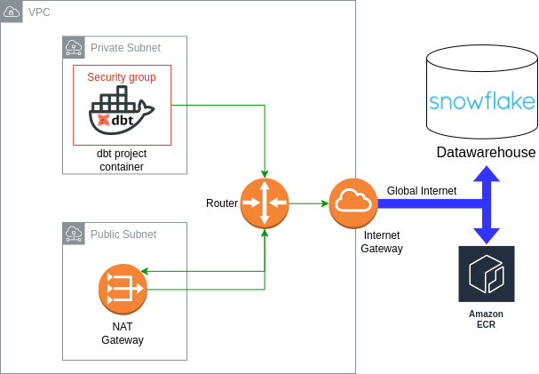

# data-engineering-challenge


## 1. Introduction
This project serves to demonstrate proficiency in Data Engineering, problem-solving abilities, 
and knowledge in Software development. The challenge involves making 
the massive data set of fire incidents in San Francisco, United States, available 
in a data warehouse for analysis and visualization. The dataset, hosted by 
[Socrata](https://dev.socrata.com/), comprises approximately 650k rows and 64 columns. 
Detailed information about the dataset can be found 
[here](https://data.sfgov.org/Public-Safety/Fire-Incidents/wr8u-xric/about_data).

### 1.1 Project Overview
The project's cloud infrastructure is entirely coded using Terraform, located in 
the `infra-as-code` folder. Additionally, it integrates with a dbt project under 
the `data_engineering_challenge` folder, allowing analytics to organize and run their 
SQL scripts on Snowflake seamlessly. The project utilizes Pipenv as its Python 
virtualenv management tool.

### 1.2 Solution Implemented
Given the large size of the fire incidents dataset, handling, 
transforming, and storing it becomes a real-world data engineering 
challenge. Luckily, Socrata provides a comprehensive API for 
fetching data programmatically using pagination and query statements. 
The chosen solution involves several stages outlined below.
<p align="center">
  
  <br/>
</p>

Let us go through each stage of the data journey, one piece at a time in order to clarify what is 
happening on the image above.

### 1.2.1 Pulling Information from Socrata API
A Python code snippet deployed within a Lambda function fetches data from Socrata using 
AWS Secret Manager to retrieve API keys. This code retrieves 50,000 dataset records per request, 
transforms geo-coordinate points within the JSON structure, and fetches missing points from 
the Google Maps API using street addresses. The Lambda then aggregates batches of 
500 records and sends them to Kinesis Data Firehose using the `put_record_batch` method from the 
Firehose SDK API.

### 1.2.2 Aggregation and Dynamic Partitioning
Firehose buffers records for 30 seconds or until 10MB chunks are reached. 
It dynamically partitions records by the files ingestion date and delivers them to S3.
Check the image below to observe the partitioning of records in S3 facilitated by Firehose.
<p align="center">
  
  <br/>
</p>

### 1.2.3 Ingesting Data into Snowflake
Snowflake is chosen as the data warehouse due to its high availability, seamless data sharing, 
impressive performance, and the absence of any manual maintenance requirements. 
To seamlessly ingest data from S3 into Snowflake, the Snowpipe mechanism is employed. 
Snowpipe enables loading data from files as soon as they’re available in a stage, ensuring data 
availability in micro-batches. Snowpipe makes the data available to users within minutes, 
rather than manually executing COPY statements on a schedule to load larger batches. 
[This](https://docs.snowflake.com/en/user-guide/data-load-snowpipe-auto-s3) document explain 
step by step how snowpipe is configured. Within the context of this project, 
[this](https://github.com/gpass0s/data-engineering-challenge/blob/main/utils/snowpipe_creation.sql) file 
contains the commands utilized for setting up Snowpipe, 
facilitating the ingestion of San Francisco fire incident data into Snowflake

### 1.2.4 Data Enhancement using dbt
A dbt project is integrated to flatten incoming JSON files from Snowpipe. 
This project, located in the `data_engineering_challenge` folder, includes a dbt 
model that flattens the JSON files and builds an incremental table within Snowflake, 
containing all 650k records and 64 columns from the SF fire incidents dataset. 
The dbt project is automatically deployed to AWS using a CI/CD pipeline.

### 1.2.5 Data Visualization
Metabase, an open-source visualization tool, is chosen for 
creating dashboards and exploring the SF fire incident data. For this challenge, 
Metabase Cloud is used to make the analysis public with minimal maintenance. 
Access the dashboards and visualizations
[here](https://passos-data-engineering.metabaseapp.com/public/dashboard/d5ac4a5b-ac3c-4728-843e-e15eca9bcb54).
<p align="center">
  
  <br/>
</p>

### 1.3 Project Tree Directory Structure
```css
├── data_engineering_challenge
│   ├── analyses
│   ├── dbt_packages
│   ├── dbt_project.yml
│   ├── logs
│   │   └── dbt.log
│   ├── macros
│   ├── models
│   │   ├── san_francisco_fire_incidents.sql
│   │   └── sources.yml
│   ├── profiles.yml
│   ├── README.md
│   ├── scripts
│   │   └── dbt_container_init_commands.sh
│   ├── seeds
│   ├── snapshots
│   └── tests
├── dbt.dockerfile
├── infra-as-code
│   ├── backend.tf
│   ├── dbt.compute.engine.settings.tf
│   ├── main.tf
│   ├── modules
│   │   ├── ecr
│   │   │   ├── main.tf
│   │   │   ├── outputs.tf
│   │   │   └── variables.tf
│   │   ├── ecs-cluster
│   │   │   ├── main.tf
│   │   │   ├── outputs.tf
│   │   │   ├── variables.tf
│   │   │   └── versions.tf
│   │   ├── ecs-task-definition
│   │   │   ├── logging
│   │   │   │   ├── main.tf
│   │   │   │   ├── outputs.tf
│   │   │   │   └── variables.tf
│   │   │   ├── main.tf
│   │   │   ├── outputs.tf
│   │   │   ├── permissions
│   │   │   │   ├── main.tf
│   │   │   │   ├── outputs.tf
│   │   │   │   └── variables.tf
│   │   │   └── variables.tf
│   │   ├── kinesis-data-firehose
│   │   │   ├── main.tf
│   │   │   ├── observability
│   │   │   │   ├── main.tf
│   │   │   │   ├── variables.tf
│   │   │   │   └── versions.tf
│   │   │   ├── outputs.tf
│   │   │   ├── permissions
│   │   │   │   ├── main.tf
│   │   │   │   ├── outputs.tf
│   │   │   │   ├── variables.tf
│   │   │   │   └── versions.tf
│   │   │   ├── variables.tf
│   │   │   └── versions.tf
│   │   ├── lambda
│   │   │   ├── cloudwatch-trigger
│   │   │   │   ├── main.tf
│   │   │   │   ├── outputs.tf
│   │   │   │   ├── variables.tf
│   │   │   │   └── versions.tf
│   │   │   ├── invoker
│   │   │   │   ├── main.tf
│   │   │   │   ├── variables.tf
│   │   │   │   └── versions.tf
│   │   │   ├── main.tf
│   │   │   ├── observability
│   │   │   │   ├── main.tf
│   │   │   │   ├── variables.tf
│   │   │   │   └── versions.tf
│   │   │   ├── outputs.tf
│   │   │   ├── package
│   │   │   │   ├── main.tf
│   │   │   │   ├── outputs.tf
│   │   │   │   ├── variables.tf
│   │   │   │   └── versions.tf
│   │   │   ├── variables.tf
│   │   │   └── versions.tf
│   │   ├── lambda-layer
│   │   │   ├── build
│   │   │   │   ├── main.tf
│   │   │   │   ├── outputs.tf
│   │   │   │   ├── variables.tf
│   │   │   │   └── versions.tf
│   │   │   ├── main.tf
│   │   │   ├── outputs.tf
│   │   │   ├── variables.tf
│   │   │   └── versions.tf
│   │   ├── permissions
│   │   │   ├── lambda-dbt-trigger-service-role
│   │   │   │   ├── main.tf
│   │   │   │   ├── outputs.tf
│   │   │   │   └── variables.tf
│   │   │   ├── lambda-fetcher-service-role
│   │   │   │   ├── main.tf
│   │   │   │   ├── outputs.tf
│   │   │   │   └── variables.tf
│   │   │   └── s3-access-role-for-snowflake
│   │   │       ├── main.tf
│   │   │       ├── outputs.tf
│   │   │       ├── variables.tf
│   │   │       └── versions.tf
│   │   ├── s3
│   │   │   ├── main.tf
│   │   │   ├── outputs.tf
│   │   │   ├── variables.tf
│   │   │   └── versions.tf
│   │   └── vpc-resources
│   │       ├── elastic-ip
│   │       │   ├── main.tf
│   │       │   ├── outputs.tf
│   │       │   └── variables.tf
│   │       ├── internet-gateway
│   │       │   ├── main.tf
│   │       │   ├── outputs.tf
│   │       │   └── variables.tf
│   │       ├── nat-gateway
│   │       │   ├── main.tf
│   │       │   ├── outputs.tf
│   │       │   └── variables.tf
│   │       ├── route-table
│   │       │   ├── main.tf
│   │       │   ├── outputs.tf
│   │       │   └── variables.tf
│   │       ├── security-group
│   │       │   ├── main.tf
│   │       │   ├── outputs.tf
│   │       │   └── variables.tf
│   │       ├── subnet
│   │       │   ├── main.tf
│   │       │   ├── outputs.tf
│   │       │   └── variables.tf
│   │       └── vpc
│   │           ├── main.tf
│   │           ├── outputs.tf
│   │           └── variables.tf
│   ├── s3.bucket.settings.tf
│   ├── variables.default.tf
│   └── vpc.settings.tf
├── lambda-code
│   ├── dbt_trigger.py
│   └── fetcher.py
├── Pipfile
├── Pipfile.lock
├── README.md
├── requirements_dbt.txt
├── requirements.txt
└── utils
    ├── images
    │   ├── data-engineering-challenge.png
    │   ├── dbt_deployment_on_ECS_Fargte_architecture.png
    │   ├── deployment_pipeline_snapshot.png
    │   └── s3_bucket_snapshot.png
    ├── lambda-deployment-packages
    │   └── lambda-layer.zip
    ├── lambda_layer_builder.sh
    └── snowpipe_creation.sql
```
## 2. Usage

2.1. Clone this repository:
```bash
git clone git@github.com:gpass0s/data-engineering-challenge.git
```
2.2. Access the project's "infra-as-code" folder:
```bash
cd data-engineering-challenge/infra-as-code
```
2.3. Access the project's "infra-as-code" folder:
```bash
export AWS_ACCESS_KEY_ID=<your-aws-access-key-id>
export AWS_SECRET_ACCESS_KEY=<your-aws-secret-access-key>
export AWS_DEFAULT_REGION=<your-aws-region>
```
2.4. Set the Terraform:
```bash
terraform init --backend-config="<your-bucket>"
```
2.5. Set the Terraform Environment:
```bash
terraform workspace select $ENV || terraform workspace new $ENV
```
2.6. Create a Terraform plan:
```bash
terraform plan
```
2.7. Apply the terraform project on your own AWS account:
```bash
terraform apply -auto-approve
```

## 3. Github Actions Workflows for dbt and Terraform Deployment
This repository employs GitHub Actions workflows to automate the deployment of both the 
Terraform infrastructure and dbt project on AWS. The workflow, outlined in this
YAML file, orchestrates the seamless execution of deployment processes.
<p align="center">
  
  <br/>
</p>

### 3.1 dbt project deployment workflow

This repository implements a demo CI/CD pipeline designed to deploy the dbt project 
on ECS Fargate through GitHub Actions automatically. 
The pipeline is triggered whenever a developer pushes changes to the 
`data_engineering_challenge` folder. Next, a GitHub Actions job starts by building 
a docker image defined in the dbt.dockerfile located in the 
main directory of this project. This job then pushes the image to an AWS ECR 
repository and deploys an ECS cluster, ECS task definition in Fargate mode, and a 
Lambda function. The Lambda function called dbt_trigger executes a Python code that retrieves Snowflake 
credentials from AWS Secret Manager and spins up the dbt project container on ECS.

<p align="center">
  
  <br/>
</p>

### 3.2 Networking configuration required for running dbt containers
This section address the essential networking configurations required 
for running dbt containers on ECS. As depicted in Figure 8, the ECS 
task definition specifies its network mode parameter as “awsvpc”, 
indicating that the task container must operate within a subnet and be 
governed by a security group regulating its inbound and outbound traffic. 
Opting for a private subnet deployment involves setting up a NAT gateway, 
a public subnet, and an internet gateway to ensure connectivity from the 
private subnet to the global internet. Note that communication between 
the dbt containers and the Snowflake data warehouse account traverses 
the global internet.

<p align="center">
  
  <br/>
</p>